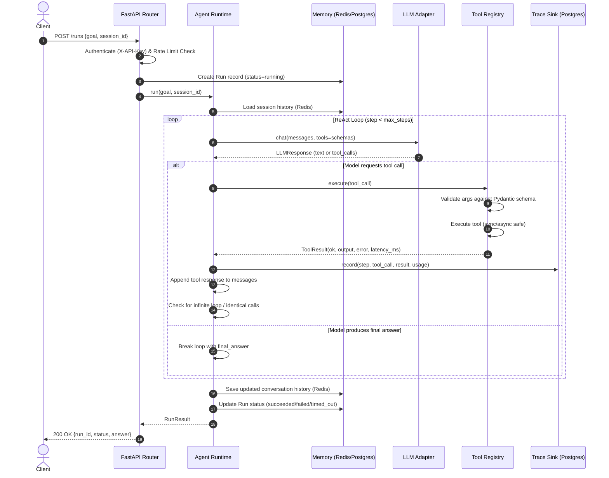

# AgentKit Architecture & Data Flow

This document details the system design, layering principles, component interactions, and data flows of **AgentKit**.

---

## 1. System Overview

AgentKit is a lightweight, framework-agnostic ReAct agent runtime written in async Python. It executes user-defined natural language goals by repeatedly calling an LLM, selecting and executing registered tools, persisting step-by-step telemetry, and maintaining session state.

```
                    ┌──────────────────────────────────────────┐
 Client ──HTTP──▶   │  FastAPI (API layer)                     │
                    │  auth, validation, rate limiting         │
                    └──────────────┬───────────────────────────┘
                                   │
                                   ▼
                    ┌──────────────────────────────┐
                    │  Agent Runtime (ReAct loop)  │
                    │  max_steps, timeout, retries │
                    └──┬───────────┬───────────┬───┘
                       │           │           │
                       ▼           ▼           ▼
                Tool Registry  LLM Adapter   Memory
                (@tool, JSON   (Gemini /     Redis: session
                 schema,        OpenAI)      Postgres: runs,
                 Pydantic)                    steps
                       │
                       ▼
                 Built-in Tools
                 (web_search, calculator, sql_readonly,
                  read_file, http_fetch)
                       │
                       ▼
                 Trace Logger ──▶ Postgres (steps table)
```

---

## 2. Layering Principles & Dependency Inversion

AgentKit follows clean architecture principles:
1. **API Layer (`agentkit/api`)**:
   - Handles HTTP endpoints, API key verification, request validation, and Redis-backed rate limiting.
   - Depends on `agentkit/core` and provides dependency injection into routes.
2. **Core Layer (`agentkit/core`)**:
   - Contains the core ReAct reasoning loop, execution state machine, and trace collector.
   - **Never imports from `agentkit/api`**.
   - Depends only on **abstract interfaces**:
     - `LLMClient` (`agentkit/llm/base.py`)
     - `MemoryStore` (`agentkit/memory/base.py`)
     - `TraceSink` (`agentkit/core/trace.py`)
   - Concrete implementations are injected at application startup.
3. **Tool Layer (`agentkit/tools`)**:
   - Provides `@tool` decorator, automatic Pydantic schema generation, parameter validation, and safe execution wrappers.
   - Houses built-in sandboxed tools (`calculator`, `sql_readonly`, `read_file`, `http_fetch`, `web_search`).
4. **LLM Adapter Layer (`agentkit/llm`)**:
   - Converts internal domain message types (`Message`, `ToolCall`, `LLMResponse`) to/from provider-specific SDK formats (Google Gemini, OpenAI).
   - Handles exponential backoff retries with jitter for transient provider failures.
5. **Memory & Persistence Layer (`agentkit/memory`, `agentkit/db`)**:
   - Redis store: Ephemeral conversation history per `session_id` with TTL, plus rate limiting counters.
   - PostgreSQL store: Durable historical record of runs and execution steps via SQLAlchemy 2.0 async sessions.

---

## 3. Data Flow

When a client initiates an agent run via `POST /runs`:



---

## 4. Security & Safety Guardrails

- **AST Calculator**: Only safe AST node evaluations are allowed. `eval()` and `exec()` are strictly banned.
- **Read-Only SQL**: Queries are parsed and validated to ensure only single `SELECT` statements are executed. DDL/DML, multi-statement injection, and comment trickery are rejected. DB role is read-only.
- **Path Traversal Protection**: `read_file` validates resolved canonical paths against a configured root directory (`FILE_TOOL_BASE_DIR`). Symlink escapes outside base dir are rejected.
- **SSRF Protection**: `http_fetch` blocks IPv4/IPv6 private address spaces, loopback (`127.0.0.1`), link-local (`169.254.169.254`), and non-HTTP/HTTPS protocols.
- **Untrusted Tool Outputs**: Tool outputs are always fed back as distinct tool-role messages, never interpolated into the system prompt, mitigating prompt injection.
- **Loop & Step Limits**: Enforced hard limits on execution steps (`MAX_STEPS`), overall execution timeout (`RUN_TIMEOUT_S`), per-tool timeout (`TOOL_TIMEOUT_S`), and duplicate call detection.
